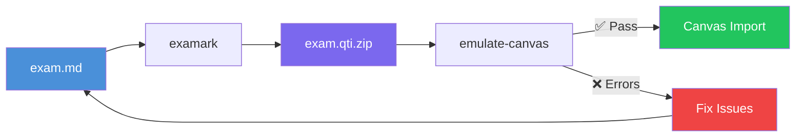

# Canvas Import Workflow

> **TL;DR** (30 seconds)
> - **What:** End-to-end guide: Markdown file to working Canvas quiz
> - **Why:** The complete happy path with validation at every step
> - **How:** Write `.md` → `examark convert` → `emulate-canvas` → Canvas Import
> - **Next:** [Your First Quiz](first-quiz.md) if you haven't installed Examark yet

Everything you need to get from Markdown to a successfully imported Canvas quiz.

---

## How It Works



**The three-step loop:**

1. **Write** your exam in Markdown (`.md` or `.qmd`)
2. **Convert** to QTI with `examark`
3. **Validate** with `emulate-canvas` — catch errors before uploading

Run the emulator until you see `✅ PREDICTION: Canvas import will likely SUCCEED`, then upload.

---

## Supported Question Types

Canvas supports these question types from Examark:

| Type | Marker | Canvas Name | Notes |
|------|--------|-------------|-------|
| Multiple Choice | `[MC]` | Multiple Choice | One correct answer |
| True/False | `[TF]` | True/False | Binary questions |
| Multiple Answers | `[MA]` | Multiple Answers | 2+ correct answers required |
| Short Answer | `[Short]` | Fill in the Blank | Accepts multiple answers |
| Essay | `[Essay]` | Essay | Manually graded |
| Numerical | `[Num]` | Numerical | Exact value or range |
| Matching | `[Match]` | Matching | Pair relationships |
| Fill in Multiple Blanks | `[FMB]` | Fill in Multiple Blanks | Multiple blanks in stem |

---

## Correct Answer Markers

All markers are case-insensitive and interchangeable:

=== "Recommended"

    ```markdown
    1. [MC] What is the mean of 2, 4, 6? [2pts]
    a) Three
    b) Four [x]
    c) Five
    ```

=== "Checkmark"

    ```markdown
    1. [MC] What is the mean of 2, 4, 6? [2pts]
    a) Three
    b) Four ✓
    c) Five
    ```

=== "Star prefix (Multiple Answers)"

    ```markdown
    2. [MA] Which are measures of spread? [3pts]
    *a) Variance
    b) Mean
    *c) Standard deviation
    *d) Range
    ```

| Marker | Example | Use For |
|--------|---------|---------|
| `[x]` | `b) Answer [x]` | MC, TF, MA |
| `✓` or `✔` | `b) Answer ✓` | MC, TF, MA |
| `[correct]` | `b) Answer [correct]` | MC, TF, MA |
| `**bold**` | `b) **Answer**` | MC, TF (legacy) |
| `*` prefix | `*b) Answer` | MA (select-all) |

---

## Short Answer: Multiple Accepted Answers

Two equivalent syntaxes:

=== "= syntax (Recommended)"

    ```markdown
    5. [Short] What pattern indicates unequal variance? [2pts]
    = funnel
    = funnel shape
    = fan shape
    = megaphone
    ```

=== "Answer: syntax"

    ```markdown
    5. [Short] What pattern indicates unequal variance? [2pts]
    Answer: funnel
    Answer: funnel shape
    Answer: fan shape
    ```

The `=` syntax is preferred for readability when listing multiple acceptable answers. Both parse identically.

!!! note "Case Sensitivity"
    Canvas short answer matching is case-insensitive by default. List the most common spellings/phrasings.

---

## Multiple Answers: Getting Full Credit

Canvas Multiple Answers questions grade students on selecting **all correct** options and **none of the incorrect** ones. The QTI structure must explicitly exclude incorrect options.

**Correct format:**

```markdown
3. [MA] Which assumptions does OLS regression require? [4pts]
*a) Linearity
b) Large sample size
*c) Independence of errors
*d) Homoscedasticity
e) Normality of predictors
```

The `*` prefix marks correct answers. Examark automatically generates the required `<not><varequal>` exclusions for incorrect options in the QTI output.

!!! warning "Minimum 2 correct answers"
    Canvas rejects MA questions with fewer than 2 correct answers. The validator will flag this as a blocking error.

---

## Validation Pipeline

Run validation before uploading:

```bash
# Step 1: Check the Markdown source
examark check exam.md

# Step 2: Convert
examark exam.md -o exam.qti.zip

# Step 3: Emulate Canvas import
examark emulate-canvas exam.qti.zip
```

### What the emulator catches

| Check | What It Means |
|-------|---------------|
| **MA cardinality** | MA questions must use `rcardinality="Multiple"` |
| **MA incorrect exclusion** | Canvas needs explicit `<not>` for each wrong option |
| **Short answer answers** | Short answer must have at least one accepted answer |
| **Correct answer defined** | MC/TF must have a correct answer marked |
| **Option count** | Need at least 2 answer choices |
| **Image references** | All bundled images must exist |
| **Security** | No XSS vectors allowed |

### Success output

```text
🎓 Canvas Import Emulator

📊 Analysis Results:
   Items scanned: 18
   Resources: 19
   Has test structure: Yes

✅ PREDICTION: Canvas import will likely SUCCEED
```

### Failure output (with fix hints)

```text
❌ PREDICTION: Canvas import will likely FAIL

🔴 Canvas Import Blockers:
   • Multiple answers question q3: rcardinality="Single" (must be "Multiple")
   • Short answer question q7: no correct answers defined

🔧 Suggested Fixes:
   → Q3: Add a second correct answer with * prefix
   → Q7: Add "Answer: text" or "= text" line after question stem
```

---

## Quarto → Canvas Workflow

For Quarto (`.qmd`) files with R/Python code:

### Automatic (Recommended)

Add a post-render hook to `_quarto.yml` — QTI is generated automatically after every render:

```yaml
project:
  type: default
  output-dir: _output
  render:
    - "exam/*.qmd"
  post-render: ./_quarto-post-render.sh
```

```bash
# One command does both steps
quarto render exam.qmd --to exam-gfm
# ✅ QTI package ready: _output/exam/exam.qti.zip
```

The `_quarto-post-render.sh` script is included in the starter template (`quarto use template Data-Wise/examark`).

!!! note "Quarto 1.8+ path requirement"
    Use `post-render: ./_quarto-post-render.sh` with the `./` prefix. Bare filenames fail in Quarto 1.8+ due to Deno path resolution.

### Manual

```bash
# Step 1: Render to GFM (Markdown)
quarto render exam.qmd --to exam-gfm

# Step 2: Convert to QTI
examark _output/exam/exam.md -o exam.qti.zip

# Step 3: Validate
examark emulate-canvas exam.qti.zip
```

Or add `exam.qti: true` to your YAML frontmatter — Quarto prints the exact `examark` command to run after rendering.

!!! tip "R-generated figures"
    Examark automatically bundles R-generated plots from Quarto code chunks into the QTI package. Run `quarto render` before `examark` so all figures are generated first.

---

## Importing to Canvas

After `emulate-canvas` shows ✅:

1. Go to **Course Settings** → **Import Course Content**
2. Select **QTI .zip file** as Content Type
3. Upload your `.qti.zip` file
4. Click **Import**
5. Find imported questions in **Quizzes** → **Question Banks**

### Item Banks (New Quizzes)

To import directly to an Item Bank:

1. Go to **Course Settings** → **Manage Item Banks**
2. Click **Import Content**
3. Upload your `.qti.zip`

Item Banks work with Canvas New Quizzes and support random question selection. See the [Item Banks tutorial](item-banks.md).

---

## Common Errors

### "Couldn't determine correct answers" for Multiple Answers

**Cause:** QTI `rcardinality` set to `"Single"` instead of `"Multiple"`.

**Fix:** Ensure your MA questions use `*` prefix markers:

```markdown
2. [MA] Which are valid? [2pts]
*a) Option A   ← * marks correct
b) Option B
*c) Option C
```

Examark automatically sets `rcardinality="Multiple"` for `[MA]` questions.

---

### "No correct answers" for Short Answer

**Fix:** Add accepted answers after the question stem:

```markdown
6. [Short] Define heteroscedasticity. [2pts]
= unequal variance
= non-constant variance
= heteroskedasticity
```

---

### Images Not Appearing in Canvas

**Fix:** Ensure your image paths are relative and images are present at render time:

```markdown

```

Examark bundles images relative to the input file directory.

---

### Points Not Importing

Canvas uses the points from QTI metadata. Specify per-question:

```markdown
1. [MC] Question text? [5pts]
```

Or set a project default in `.examarkrc.json`:

```json
{ "defaultPoints": 2 }
```

---

## Related

- [Canvas Quick Reference](../reference/REFCARD-CANVAS.md) — One-page cheat sheet
- [Question Types Gallery](../markdown/question-types.md)
- [Syntax Reference](../markdown/syntax.md)
- [Canvas Emulator](../emulator.md)
- [Item Banks](item-banks.md)
- [Quarto Integration](quarto.md)
