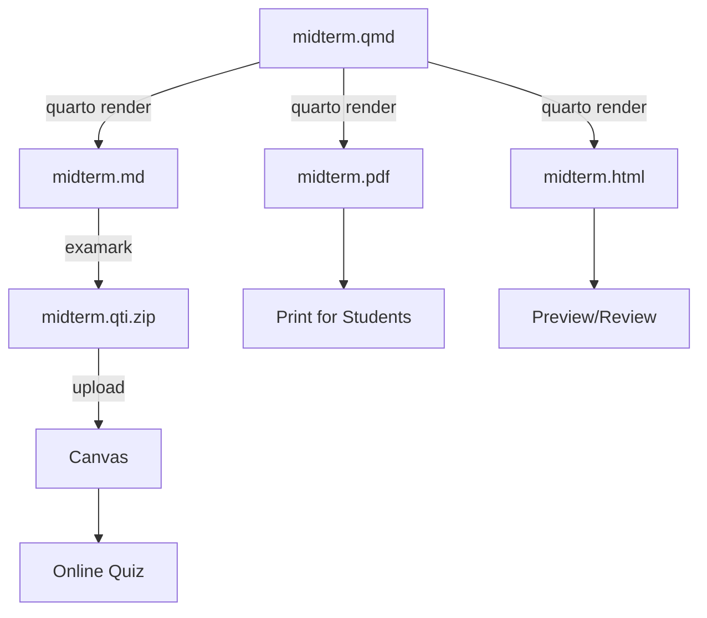

# Quarto Daily Workflow

> **TL;DR** Master the daily Quarto workflow: R code chunks for dynamic values, auto-generated plots, multiple exam versions, and the `= answer` syntax.

**15 minutes** | Intermediate | Quarto

---

## Problem

You have Quarto set up and want to use R/Python to generate randomized exam questions, embed plots, and create multiple exam versions.

## Solution

### Random Values

Use R inline code to generate unique values:

````markdown
```{r setup, include=FALSE}
set.seed(42)  # For reproducibility
values <- sample(10:50, 5)
correct_mean <- mean(values)
```

## 1. Calculate the Mean [2 pts]

Find the mean of: `r paste(values, collapse=", ")`

a) `r correct_mean - 5`
b) **`r correct_mean`** [correct]
c) `r correct_mean + 5`
d) `r correct_mean + 10`
````

### Generated Plots

Embed R-generated figures directly:

````markdown
```{r histogram, echo=FALSE, fig.cap="Score Distribution"}
hist(rnorm(100, mean=75, sd=10),
     main="Exam Scores",
     xlab="Score",
     col="steelblue")
```

## 3. Histogram Shape [2 pts]

What is the shape of the distribution shown above?

a) Positively skewed
b) Negatively skewed
c) **Approximately normal** [correct]
d) Uniform
````

### Computed Answers

Calculate correct answers programmatically:

````markdown
```{r regression, include=FALSE}
x <- 1:10
y <- 2*x + 3 + rnorm(10, 0, 0.5)
model <- lm(y ~ x)
slope <- round(coef(model)[2], 2)
```

## 4. Regression Slope [3 pts]

Given the regression output, the slope is approximately:

a) `r slope - 0.5`
b) **`r slope`** [correct]
c) `r slope + 0.5`
d) `r slope + 1`
````

### Creating Multiple Exam Versions

Use different seeds to create parallel exam versions:

```r
# Version A
set.seed(100)

# Version B
set.seed(200)

# Version C
set.seed(300)
```

Automate the build with a shell script (`build_exams.sh`):

```bash
#!/bin/bash

# Build Version A
sed -i '' 's/set.seed([0-9]*)/set.seed(100)/' midterm.qmd
quarto render midterm.qmd
mv midterm.md version-a.md
examark version-a.md -o version-a.qti.zip

# Build Version B
sed -i '' 's/set.seed([0-9]*)/set.seed(200)/' midterm.qmd
quarto render midterm.qmd
mv midterm.md version-b.md
examark version-b.md -o version-b.qti.zip

# Verify both
examark verify version-a.qti.zip
examark verify version-b.qti.zip
```

---

## Best Practices

### 1. Hiding Solutions

Wrap solutions in a `.solution` div — they are automatically hidden:

```markdown
## 1. What is the variance formula?

a) Wrong
b) **Correct** [correct]

::: {.solution}
The variance formula divides by n-1 for sample variance...
:::
```

### 2. Use `[correct]` Markers

The `[correct]` suffix is more reliable than bold or checkmarks when using R code:

```markdown
a) `r value_a`
b) `r value_b` [correct]
c) `r value_c`
```

### 3. Short Answer with `= answer` Syntax

For short answer questions with multiple acceptable answers, use the `= answer` syntax:

```markdown
## 5. [Short] What test compares two group means? [2pts]
= t-test
= t test
= independent samples t-test
= two-sample t-test
```

Each `=` line adds an acceptable answer variant. Canvas auto-grades if the student's response matches any variant.

!!! tip "Quarto Compatibility"
    In `.qmd` files, wrap `= answer` lines in a `{=markdown}` raw block to prevent Pandoc from treating them as paragraph continuation:

    ````markdown
    ```{=markdown}
    = t-test
    = t test
    ```
    ````

### 4. Preview Before Export

Always preview in HTML first:

```bash
quarto render midterm.qmd --to exam-html
open midterm.html  # Check formatting
```

### 5. Verify the QTI Package

Run the Canvas emulator before uploading:

```bash
examark emulate-canvas midterm.qti.zip
```

---

## Complete Workflow Diagram



---

## Troubleshooting

### R Code Not Executing

1. Ensure R is installed
2. Install the `knitr` package: `install.packages("knitr")`
3. Verify code chunks use proper syntax: `` ```{r} ``

### Figures Not Appearing in Canvas

1. Check that figures are in the same directory as the `.md` file
2. Verify the QTI package includes them: `unzip -l exam.qti.zip`
3. Use relative paths in your Markdown

### Math Rendering Issues

1. Use `variant: +tex_math_dollars` in your YAML
2. Ensure Canvas has MathJax enabled (course settings)
3. Test with simple math first: `$x^2$`

## Explanation

- R code chunks execute during `quarto render` — Examark never sees R code, only the rendered values and images.
- The `set.seed()` strategy ensures reproducibility: same seed always produces the same random values, making exam versions deterministic.
- Figures generated by R are saved as image files alongside the Markdown output. Examark automatically bundles them into the QTI package.
- The `[correct]` marker is preferred over `**bold**` in Quarto because R inline code (`` `r value` ``) inside bold markers can cause parsing ambiguity.
- The `= answer` syntax requires `{=markdown}` raw blocks in `.qmd` files because Pandoc treats bare `= text` lines as paragraph continuation.

## See Also

- [Quarto Extension Setup](quarto-setup.md) — Installation and first exam
- [Randomized Values](randomized-values.md) — R code chunks for dynamic questions
- [Import & Validate](import-validate.md) — Full Canvas import and verification guide
- [Quarto Extension Reference](../extensions/quarto.md) — Full configuration options
- [Markdown Syntax](../markdown/syntax.md) — All question type syntax
