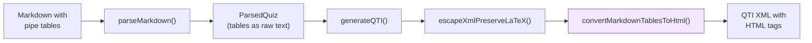

# SPEC: Markdown Tables to HTML in QTI Generator

**Status:** draft
**Created:** 2026-03-06
**From Brainstorm:** Deep feat brainstorm, 8 questions answered interactively
**ORCHESTRATE:** `feature/markdown-tables-to-html` worktree (existing plan expanded)

---

## Overview

Convert markdown pipe tables in exam content to HTML `<table>` elements during QTI generation, so Canvas renders tables correctly instead of showing garbled pipe characters. Tables appear in question stems, answer options, and feedback blocks. Cell content frequently contains LaTeX math that must be preserved.

---

## Primary User Story

**As a** statistics instructor writing exams in Markdown/Quarto,
**I want** tables (ANOVA, regression, contingency) in my exam questions to render correctly in Canvas,
**So that** students see properly formatted statistical output instead of broken pipe characters.

### Acceptance Criteria

- [ ] Markdown pipe tables in question stems convert to HTML `<table>` in QTI output
- [ ] Tables in answer options convert correctly (per-option tables)
- [ ] Tables in feedback blocks convert correctly
- [ ] LaTeX math in table cells (`$F$`, `$p < 0.05$`) preserves and renders in Canvas
- [ ] Column alignment (`:---`, `:---:`, `---:`) generates correct HTML attributes
- [ ] Canvas import emulator passes with table content
- [ ] Canvas actually renders the HTML tables (manual verification required)
- [ ] All existing 265+ tests continue to pass

---

## Secondary User Stories

**As a** statistics instructor using Quarto with `kable()`,
**I want** HTML tables from R output to also pass through correctly,
**So that** both hand-written and R-generated tables work in Canvas.

**As an** exam author writing "which table is correct?" questions,
**I want** different tables in each answer option,
**So that** students can compare statistical output visually.

---

## Architecture



**Key decision:** Generator-only approach. Tables remain as raw text through parsing, converted to HTML at QTI output time in `escapeXmlPreserveLaTeX()`.

### Processing Order in `escapeXmlPreserveLaTeX()`

1. Extract image placeholders
2. Extract code block placeholders
3. **NEW: Convert markdown tables to HTML** (before XML escaping)
4. Extract HTML table placeholders (protect from XML escaping)
5. LaTeX conversion (`$...$` to `\(...\)`)
6. XML entity escaping
7. Restore all placeholders

---

## API Design

N/A - No API changes. Internal function addition only.

### New Function Signature

```typescript
function convertMarkdownTablesToHtml(text: string): string
```

**Input:** Text that may contain markdown pipe tables mixed with other content.
**Output:** Same text with pipe tables replaced by HTML `<table>` elements.
**Detection rule:** Outer pipes required (`| col1 | col2 |` format only).

---

## Data Models

N/A - No changes to `ParsedQuiz`, `Question`, or `AnswerOption` types. Tables pass through as text content.

---

## Dependencies

No new dependencies. Uses regex-based parsing (no external markdown-to-HTML library needed).

---

## UI/UX Specifications

N/A - CLI tool. No UI changes. Canvas rendering is the "UI" and must be manually verified.

### Canvas Rendering Verification (Required)

Before shipping, manually test:

1. Create a QTI package with an HTML table in a question stem
2. Import into Canvas (both Classic and New Quizzes if possible)
3. Verify table renders with visible borders and alignment
4. If Canvas strips CSS: add inline styles (`border`, `padding`, `border-collapse`)
5. Document findings in PR description

---

## Implementation Plan

### Increment 1: Core table conversion (2-3 hours)

**File:** `src/generator/qti.ts`

1. Add `convertMarkdownTablesToHtml(text: string): string`
   - Detect table blocks: consecutive lines matching `^\|(.+)\|$` with a divider row `^\|[\s:]*-+[\s:]*\|`
   - Parse header cells, alignment spec, body rows
   - Generate `<table>` with `<thead>`, `<tbody>`, `<th>`, `<td>`
   - Add Canvas class + inline style fallback: `class="ic-Table" style="border-collapse: collapse; border: 1px solid #ddd;"`
   - Add cell styles: `style="padding: 8px; border: 1px solid #ddd;"` on `<td>` and `<th>`
   - Handle alignment: `:---` = left, `:---:` = center, `---:` = right via `text-align` style

2. Integrate into `escapeXmlPreserveLaTeX()`:
   - Call `convertMarkdownTablesToHtml()` on input text
   - Use placeholder pattern (`__TABLE_PLACEHOLDER_N__`) to protect generated HTML from XML escaping
   - Restore after escaping (same pattern as images/code)

### Increment 2: Tests (1-2 hours)

**File:** `tests/generator.test.ts`

| Test | Description |
|------|-------------|
| Simple 2-col table | Basic header + 2 rows → HTML |
| Alignment | `:---:` center, `---:` right → style attributes |
| LaTeX in cells | `$F$`, `$p < 0.05$` preserved after conversion |
| Multiple tables | Two tables in one stem both convert |
| Table in option text | Answer option containing a table |
| Table in feedback | Feedback block with table |
| Non-table pipes | LaTeX `\|` not falsely detected |
| Empty cells | `| | value |` handles gracefully |
| ANOVA fixture | Real ANOVA table from practice exam |
| Inline code in cells | `` `mean()` `` in table cells |

**File:** `tests/fixtures/` — Add `table-questions.md` fixture with 5+ questions containing tables.

### Increment 3: Quarto HTML table pass-through (30 min)

Investigate whether Quarto `kable()` output produces HTML tables in GFM. If yes, ensure existing HTML `<table>` tags in input are preserved (likely already handled by placeholder extraction).

### Increment 4: Canvas verification + docs (30 min)

1. Build a test QTI package with tables
2. Import into Canvas, screenshot results
3. Adjust inline styles if needed
4. Update CLAUDE.md "Where to Look" section

---

## Edge Cases

| Case | Handling |
|------|----------|
| Empty cells `\| \| val \|` | Parse as empty `<td></td>` |
| LaTeX in cells `\| $\mu$ \|` | LaTeX converted after table conversion (via placeholder) |
| Inline code in cells | Code placeholder extraction happens before table conversion |
| Single-column table | Skip conversion (degenerate, likely not a real table) |
| `\|` in LaTeX | Not matched — requires outer pipes on both sides |
| Table without outer pipes | Not detected (by design — outer pipes required) |
| HTML tables from Quarto | Already HTML — pass through unchanged |
| Nested tables | Not supported (extremely rare in exams) |

---

## Open Questions (Research Findings — 2026-03-06)

### 1. Canvas inline styles — CONFIRMED: Use inline styles + `ic-Table` class

**Finding:** Canvas sanitizes HTML aggressively. The Rich Content Editor strips `<style>` elements entirely and removes some CSS properties (e.g., `border-radius`). However, basic inline styles on `<table>`, `<td>`, and `<th>` survive, including `border`, `padding`, and `border-collapse`.

**Canvas built-in CSS classes** (preferred approach):
- `ic-Table` — base table styling with borders
- `ic-Table--condensed` — tighter padding
- `ic-Table--striped` — alternating row shading
- `ic-Table--hover-row` — hover highlight

**Recommendation:** Use a **dual approach**:
1. Add `class="ic-Table"` to `<table>` (Canvas applies its own borders/padding)
2. Also add inline `style="border: 1px solid #ddd; border-collapse: collapse;"` as fallback
3. Add `style="padding: 8px; border: 1px solid #ddd;"` on `<td>` and `<th>`
4. For alignment: `style="text-align: center;"` (inline styles for alignment survive)

**Risk level:** LOW — Canvas classes are well-documented and stable. Inline styles as fallback cover edge cases.

Sources: [Styling Tables in Canvas](https://www.howtocanvas.com/create-amazing-pages-in-canvas/tables), [Canvas RCE HTML Cheatsheet](https://community.canvaslms.com/t5/Developers-Group/New-and-Improved-Rich-Content-Editor-HTML-Cheatsheet/ba-p/273347), [Canvas HTML/CSS whitelist](https://community.canvaslms.com/thread/9687)

### 2. Quarto kable() output — CONFIRMED: Pipe tables in GFM

**Finding:** When Quarto renders to GFM format, `knitr::kable()` automatically uses `format = "pipe"` (the default for markdown output). This produces standard markdown pipe tables, NOT HTML tables.

Key facts:
- `kable()` auto-detects output format — for GFM, it produces pipe tables
- Only `format = "html"` produces HTML `<table>` tags (user must explicitly request this)
- `kableExtra` can produce HTML tables, but these are wrapped in Pandoc `RawBlock` nodes
- Quarto can convert HTML tables in `RawBlock` nodes back to markdown tables for non-HTML formats

**Implication for examark:** The primary path is **pipe tables → HTML conversion** (our new feature). HTML tables from `kable(format="html")` or `kableExtra` are a secondary path — they pass through as-is since they're already HTML (handled by existing placeholder extraction in `escapeXmlPreserveLaTeX()`).

**Risk level:** LOW — The main case (kable → pipe table → our converter) is the standard path. HTML pass-through already works.

Sources: [R Markdown Cookbook - kable()](https://bookdown.org/yihui/rmarkdown-cookbook/kable.html), [Quarto Tables](https://quarto.org/docs/authoring/tables.html), [Quarto GFM Options](https://quarto.org/docs/reference/formats/markdown/gfm.html)

### 3. LaTeX math inside HTML table cells — CONFIRMED: Works with `\(...\)` delimiters

**Finding:** Canvas uses MathJax to render LaTeX. MathJax processes the entire page DOM, including content inside `<td>` and `<th>` elements. The key requirement is using Canvas-compatible delimiters:
- `\(...\)` for inline math (NOT `$...$`)
- `\[...\]` for display math (NOT `$$...$$`)

**Our pipeline already handles this:** `escapeXmlPreserveLaTeX()` converts `$...$` → `\(...\)` AFTER table conversion but BEFORE XML escaping. Since table HTML is protected by placeholders during XML escaping, the LaTeX delimiters inside cells are preserved correctly.

**Processing order (confirmed correct):**
1. Convert markdown tables → HTML tables
2. Extract HTML table placeholders
3. Convert LaTeX delimiters (`$` → `\(`)
4. XML-escape remaining content
5. Restore placeholders (HTML tables with LaTeX intact)

**Risk level:** LOW — MathJax renders inside table cells, and our placeholder ordering preserves the delimiters.

Sources: [Canvas LaTeX and MathJax](https://community.canvaslms.com/t5/Archived-Questions/ARCHIVED-Canvas-LaTeX-and-MathJAX/td-p/200952), [MathJax in Canvas](https://ready.msudenver.edu/self-help-tutorials/accessibility/use-mathjax-and-latex-to-display-equations-in-canvas/), [R exams2canvas](https://rdrr.io/rforge/exams/man/exams2canvas.html)

### 4. New Quizzes vs Classic — UNRESOLVED (requires manual testing)

No definitive documentation found on whether New Quizzes renders HTML tables differently from Classic Quizzes. Both use the same `mattext` content from QTI, but rendering pipelines may differ. **Must test manually before shipping.**

---

## Review Checklist

- [ ] All 265+ existing tests pass
- [ ] New table conversion tests pass (10+ cases)
- [ ] ANOVA table from practice exam renders correctly in QTI
- [ ] LaTeX math in table cells renders in Canvas
- [ ] Tables in answer options work
- [ ] Canvas import verified manually (screenshot in PR)
- [ ] `emulate-canvas` passes on table-containing packages
- [ ] CLAUDE.md updated
- [ ] No regression in Quarto GFM compatibility

---

## Implementation Notes

- The ORCHESTRATE plan in the worktree covers Steps 1-5 but scoped to stems only. This spec expands to full support (options, feedback, LaTeX cells, alignment).
- The placeholder pattern is well-established in `escapeXmlPreserveLaTeX()` — images, code, and LaTeX all use it. Tables follow the same pattern.
- Canvas inline styles: RESOLVED — use `class="ic-Table"` (Canvas built-in) + inline `border`/`padding` fallback. Both survive Canvas sanitization.
- Quarto kable(): RESOLVED — GFM output produces pipe tables by default, which our converter handles. HTML tables from kableExtra pass through unchanged via existing placeholder extraction.
- The generator-only approach means `examark check` (linter) won't validate tables. This is acceptable — tables are content, not structure.

---

## History

| Date | Change |
|------|--------|
| 2026-03-06 | Initial spec from deep brainstorm (8 questions). Expanded ORCHESTRATE plan to full support scope. |
| 2026-03-06 | Research: Resolved 3 of 4 open questions. Canvas `ic-Table` class confirmed. kable() → pipe tables confirmed. LaTeX in table cells confirmed working. New Quizzes vs Classic still needs manual test. |
