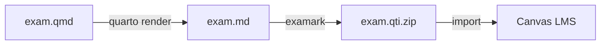

# Quarto Templates

For R and Python users who want dynamic, randomized questions.

!!! tip "Install the extension first"
    ```bash
    quarto add Data-Wise/examark
    ```

---

## Minimal Quarto

**Best for:** Quick start with Quarto

The simplest Quarto exam structure.

```yaml
---
title: "Quick Quiz"
format:
  exam-qti: default
exam:
  solutions: false
  default-points: 2
---
```

```bash
curl -O https://raw.githubusercontent.com/Data-Wise/examark/main/examples/minimal.qmd
quarto render minimal.qmd --to exam-qti
examark minimal.md -o quiz.qti.zip
```

[:material-download: Download minimal.qmd](https://github.com/Data-Wise/examark/raw/main/examples/minimal.qmd){ .md-button }

---

## Starter Template

**Best for:** Real exams with all question types

Complete template with examples of every question type.

```bash
curl -O https://raw.githubusercontent.com/Data-Wise/examark/main/examples/starter-exam.qmd
quarto render starter-exam.qmd --to exam-qti
```

[:material-download: Download starter-exam.qmd](https://github.com/Data-Wise/examark/raw/main/examples/starter-exam.qmd){ .md-button }

---

## Statistics Exam (Dynamic)

**Best for:** Math/stats courses with randomized values

Statistics exam with R-generated random values and LaTeX math.

```bash
curl -O https://raw.githubusercontent.com/Data-Wise/examark/main/examples/statistics-exam.qmd
quarto render statistics-exam.qmd --to exam-qti
```

[:material-download: Download statistics-exam.qmd](https://github.com/Data-Wise/examark/raw/main/examples/statistics-exam.qmd){ .md-button }

---

## Dynamic Questions

**Best for:** Randomized practice problems

Template showing how to generate unique question variants using R.

```bash
curl -O https://raw.githubusercontent.com/Data-Wise/examark/main/examples/dynamic-questions.qmd
```

[:material-download: Download dynamic-questions.qmd](https://github.com/Data-Wise/examark/raw/main/examples/dynamic-questions.qmd){ .md-button }

---

## With Figures

**Best for:** Data visualization questions

Template with R-generated plots embedded in questions.

```bash
curl -O https://raw.githubusercontent.com/Data-Wise/examark/main/examples/quarto-figures.qmd
```

[:material-download: Download quarto-figures.qmd](https://github.com/Data-Wise/examark/raw/main/examples/quarto-figures.qmd){ .md-button }

---

## Template Comparison

| Template | Dynamic | Figures | Best For |
|----------|---------|---------|----------|
| Minimal | No | No | Quick start |
| Starter | No | No | Real exams |
| Statistics | Yes | No | STEM courses |
| Dynamic | Yes | No | Practice problems |
| With Figures | Yes | Yes | Data analysis |

---

## Workflow



1. **Write** your exam in `.qmd` format
2. **Render** with `quarto render exam.qmd --to exam-qti`
3. **Convert** with `examark exam.md -o exam.qti.zip`
4. **Import** the `.qti.zip` into Canvas
