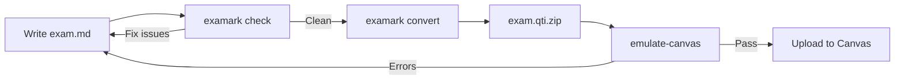
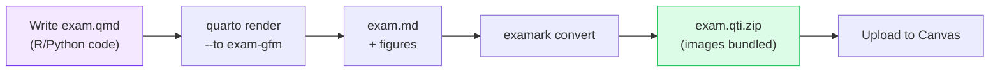
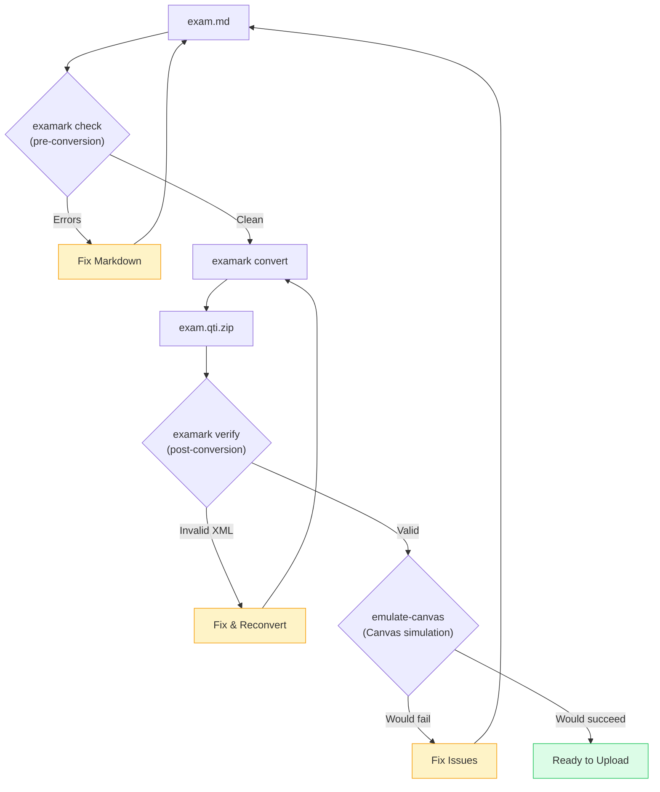
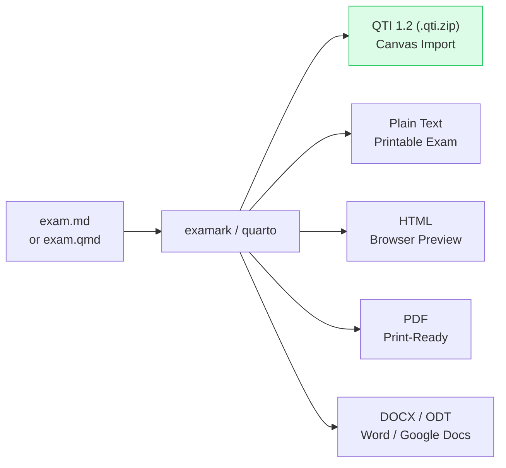
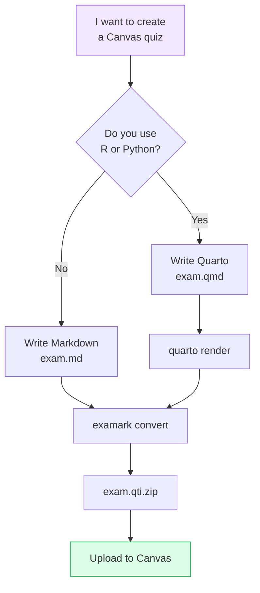

# Visual Workflows

> **TL;DR** (30 seconds)
> - **What:** Visual diagrams showing every Examark workflow at a glance
> - **Why:** See the big picture before diving into details
> - **How:** Pick your workflow below, follow the arrows
> - **Next:** [Getting Started](getting-started.md) to begin

---

## Markdown to Canvas (CLI)

The core workflow — write Markdown, get a Canvas quiz.

| Step | Command | What Happens |
|------|---------|-------------|
| 1. Lint | `examark check exam.md` | Catches missing answers, bad syntax |
| 2. Convert | `examark exam.md -o exam.qti.zip` | Generates QTI 1.2 package |
| 3. Validate | `examark emulate-canvas exam.qti.zip` | Simulates Canvas import |
| 4. Upload | Canvas → Import → QTI | Import into Classic or New Quizzes |

---

## Quarto to Canvas (R/Python)

For dynamic exams with computed answers and generated plots.

| Step | Command | What Happens |
|------|---------|-------------|
| 1. Render | `quarto render exam.qmd --to exam-gfm` | Executes R/Python, produces Markdown + figures |
| 2. Convert | `examark exam.md -o exam.qti.zip` | Bundles figures into QTI package |
| 3. Upload | Canvas → Import → QTI | Plots and computed answers appear in Canvas |

!!! tip "Post-Render Hook"
    With `exam.qti: true` in your YAML, the post-render hook runs examark automatically after `quarto render`.

---

## Validation Pipeline

How examark checks your work at each stage.

| Check | Stage | What It Catches |
|-------|-------|----------------|
| `check` | Pre-conversion | Missing stems, duplicate IDs, no correct answer |
| `verify` | Post-conversion | Invalid XML, missing files, broken references |
| `emulate-canvas` | Pre-upload | Wrong cardinality, unsupported types, security issues |

---

## Output Formats

All the ways to export your exam.

| Format | Command | Use Case |
|--------|---------|----------|
| **QTI** | `examark exam.md -o exam.qti.zip` | Canvas import |
| **Text** | `examark exam.md -f text` | Printable exam |
| **Text (no key)** | `examark exam.md -f text --no-answers` | Student handout |
| **HTML** | `quarto render exam.qmd --to exam-html` | Browser preview |
| **PDF** | `quarto render exam.qmd --to exam-pdf` | Print-ready |

---

## Choose Your Path

Not sure where to start? Follow the arrow that matches your situation:

