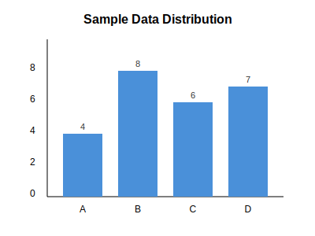
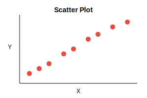

# Statistics Quiz with Figures

# Section: Graph Interpretation

## 1. Look at the bar chart below. Which category has the highest value? [2 pts]

1) Category A
2) **Category B** ✓
3) Category C
4) Category D

## 2. Based on the bar chart, what is the approximate total of all values? [3 pts]

1) 15
2) 20
3) **25** ✓
4) 30

# Section: Correlation Analysis

## 3. What type of correlation does this scatter plot show? [2 pts]

1) **Positive correlation** ✓
2) Negative correlation
3) No correlation
4) Curvilinear relationship

## 4. [TF] The scatter plot above suggests that as X increases, Y also increases. → True

# Section: Essay Questions

## 5. [Essay, 10pts] Describe the relationship shown in the scatter plot

Explain the type of correlation, its strength, and what this might mean in a real-world context.
